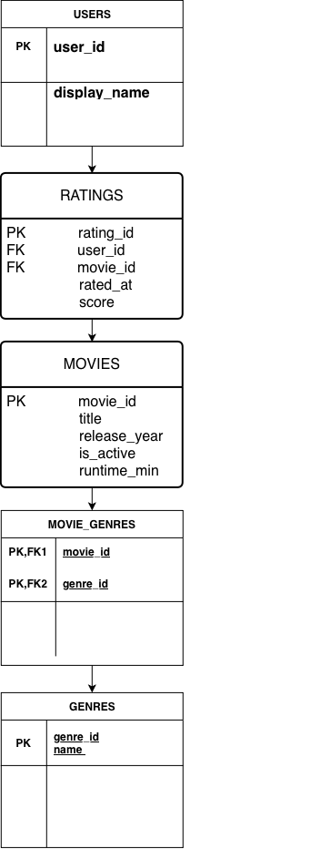

# EX 603 Movie/TV Database

## Project Summary

This project models a relational database for a Movie/TV platform where users can rate movies and movies can be classified into different genres. The database is designed to store users, movies, ratings, genres, and the relationships between movies and genres.

**Theme:** Movie / TV

## Domain

The Movie/TV platform allows users to interact with a catalog of movies by submitting ratings. The database must keep track of each user, the movies available on the platform, and the ratings users submit. Each rating connects a user to a movie and records a score that can later be used to analyze user preferences and movie performance.

Movies can belong to multiple genres, such as comedy, drama, action, or science fiction, and each genre can contain many movies. Because of this many-to-many relationship, the database uses a separate movie-genres relationship to connect movies and genres. The database must support questions such as which movies a user has rated, what ratings a movie has received, what a movie's average rating is, and which movies belong to a particular genre.

The design uses five main roles: users as the actor, movies as the producer, ratings as the event, genres as the catalog, and movie_genres as the junction between movies and genres.

## Schema

The Entity Relationship Diagram below shows the relationships between Users, Ratings, Movies, Movie Genres, and Genres.

## Unit 2 – SQL Schema Implementation

In Unit 2, the conceptual database design from Unit 1 was implemented as a PostgreSQL schema. The schema creates the five tables used by the Movie/TV database: `users`, `movies`, `ratings`, `genres`, and `movie_genres`.

The implementation includes primary keys, foreign keys, `NOT NULL`, `UNIQUE`, and `CHECK` constraints to maintain data integrity. Foreign key relationships also include `ON DELETE CASCADE` where dependent records should be removed when their related parent record is deleted.

The SQL script includes a reset block using `DROP TABLE IF EXISTS` so that the complete schema can be executed multiple times without requiring manual cleanup. The script was tested in PostgreSQL 18 and successfully executed twice in a row.

### Unit 2 Files

- [`schema/schema.sql`](schema/schema.sql) – Complete PostgreSQL DDL for the database.
- [`analysis/unit2.md`](analysis/unit2.md) – Explanation of foreign key actions and CHECK constraints.
- [`screenshots/`](screenshots/) – PostgreSQL execution and verification screenshots.

### Verification

The schema was tested by running `schema.sql` twice consecutively. The second execution successfully dropped and recreated all five tables. The PostgreSQL `\dt` command was then used to confirm that all five tables were created successfully.
